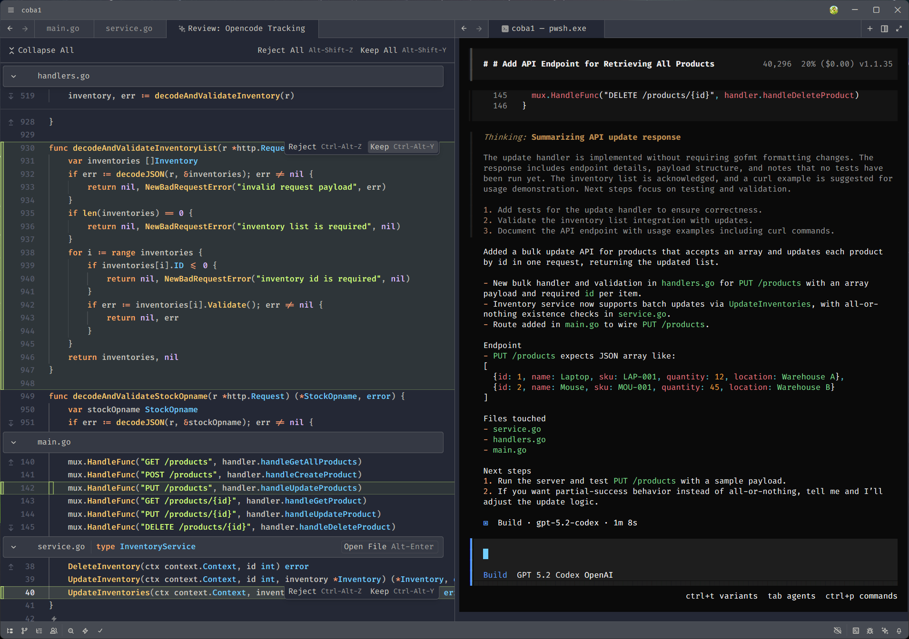

# Opencode ACP Tracking

OpenCode ACP works great inside Zed. But if you prefer prompting in the OpenCode CLI and only use Zed for reviewing diffs, this plugin is for you.

opencode-acp-tracking keeps your CLI workflow intact and shows the resulting changes in Zed with native diff highlighting. That makes it easy to review, approve, or reject changes with confidence.



## Installation
Edit `opencode.json` (OpenCode config):
```json
{ 
  "$schema": "https://opencode.ai/config.json",
  "permission": {
    "edit": "ask"
  },
  "plugin": ["@widat/opencode-acp-tracking"]
}
```
Then run:
```bash 
opencode
```

Wait until it finishes with no errors.

Edit `setting.json` (Zed config):
```json
{
  "agent_servers": {
    "Opencode Tracking": {
      "type": "custom",
      "command": "C:/Program Files/nodejs/node.exe",
      "args": [
        "C:/Users/[change_me]/.cache/opencode/node_modules/opencode-acp-tracking/dist/zed/agent.js"
      ]
    }
  }
}
```

Open `Opencode Tracking` from the External Agent panel. Wait until you see the message:
`Message Opencode Tracking - @ to include context`.
For test this plugin, do not prompt from the Zed thread. This is only a bridge connection.

Test by running prompts directly in the OpenCode CLI.

This project is for education only. Use at your own risk.
